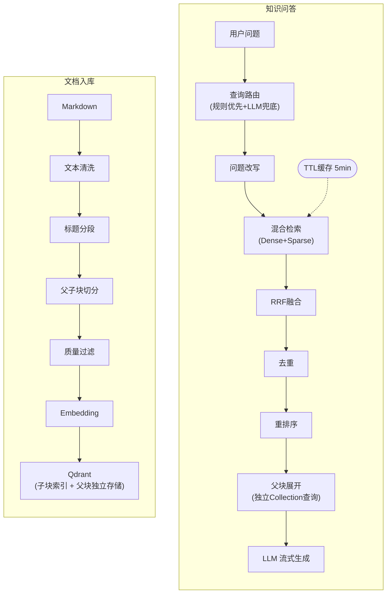
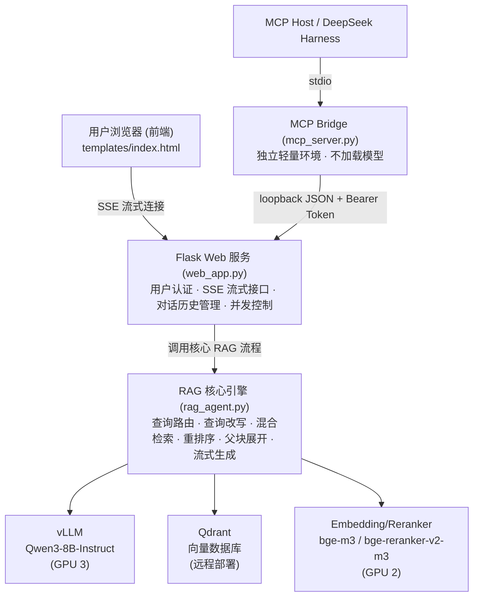
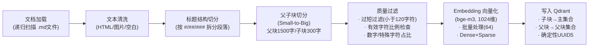
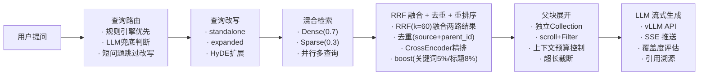
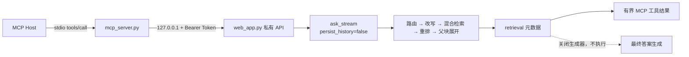

# LAB 403 RAG 系统架构设计

> 本文档是 LAB 403 RAG 知识库系统的架构设计文档，详细描述系统的整体架构、数据流、核心设计决策与优化策略。面向开发者和 AI Agent，作为理解系统设计和进行代码修改时的技术参考。

---

## 系统架构总览

### 流程概览



### 组件交互关系

系统由以下核心组件协作完成知识问答服务：



**组件协作方式：**

- **Flask Web 服务** 作为入口层，处理用户认证、会话管理，将问答请求委托给 RAG 核心引擎，并通过 SSE 将流式结果推送至前端
- **RAG 核心引擎** 编排完整的问答流程：先通过规则/LLM 路由判断意图，调用 Embedding 模型将查询向量化，再从 Qdrant 执行混合检索，用 Reranker 精排后展开父块上下文，最终调用 vLLM 生成流式回答
- **vLLM 推理服务** 提供 OpenAI 兼容 API，负责查询改写和最终回答生成两个 LLM 调用阶段
- **Qdrant 向量数据库** 存储子块向量索引和父块原文，支持 Dense + Sparse 混合检索
- **Embedding / Reranker 模型** 在 RAG 引擎内部以本地推理方式运行，分别负责查询/文档向量化和精排打分
- **MCP Bridge（可选）** 只做 stdio/JSON 协议转换；检索工具在 `retrieval` 元数据产生后关闭标准 RAG 生成器，不进入最终答案生成，也不写入历史

---

## 技术栈

| 组件 | 技术选型 |
|------|----------|
| LLM | Qwen3-8B-Instruct (vLLM 部署) |
| Embedding | BAAI/bge-m3 (1024维) |
| Reranker | BAAI/bge-reranker-v2-m3 (CrossEncoder) |
| 向量数据库 | Qdrant (远程部署) |
| Web 框架 | Flask + SSE 流式响应 |
| MCP（可选） | MCP Python SDK v2 + stdio；本机 Token 认证 JSON 旁路 |
| 前端 UI | HTML5 + CSS3 (Flexbox/Grid/backdrop-filter) + Vanilla JS，Lucide Icons (CDN)，暗色模式双支持 |
| 硬件 | 4 卡 GPU 4090 24GB（GPU 2: Embedding + Reranker, GPU 3: vLLM） |

---

## 数据流详解

### 入库数据流



**各阶段详细说明：**

1. **文档加载**：递归扫描 `DOCS_PATH` 目录，多编码尝试（UTF-8 / GBK）读取 Markdown 文件
2. **文本清洗**：移除 HTML 注释/标签、图片语法 ``、零宽字符，合并连续空行，压缩多余空白
3. **标题结构切分**：按 Markdown 标题层级（#/##/###）将文档拆分为逻辑段落，维护完整的标题层级路径（如 `文档标题 > 第一章 > 1.1节`）
4. **父子块切分 (Small-to-Big)**：
   - 父块：使用 RecursiveCharacterTextSplitter 将逻辑段落切为 1500 字符的父块，注入标题/路径前缀增强语义
   - 子块：将每个父块继续切为 300 字符的子块，子块 metadata 中保存 `parent_id` 用于回溯
5. **质量过滤**：过滤空内容、过短（<120字符）、有效字符不足、数字占比过高、特殊字符过多的块
6. **Embedding 向量化**：使用 bge-m3 生成 1024 维向量，同时产出 Dense 和 Sparse 表示，批量大小为 64
7. **写入 Qdrant**：
   - 子块以确定性 UUID5（基于 `source|parent_id|chunk_index`）写入主集合 `lab_knowledge_base`
   - 父块写入独立集合 `lab_knowledge_base_parents`（4维零向量占位，不参与相似度计算）

### 问答数据流



**各阶段详细说明：**

1. **查询路由**：规则引擎通过关键词匹配快速分流（rag_search / file_list / hybrid），未命中时调用 LLM 兜底判断意图
2. **查询改写**：LLM 将用户问题改写为 `standalone_question`（独立化）+ `expanded_queries`（扩展查询），多查询并行检索
3. **HyDE 查询扩展**：对复杂查询，LLM 先生成假设性回答文本作为额外检索 query，提升语义模糊查询的召回率
4. **混合检索**：Dense 向量检索（权重 0.7）+ Sparse 关键词检索（权重 0.3，基于 Qdrant MatchText）
5. **RRF 融合**：通过 Reciprocal Rank Fusion (k=60) 融合两路结果，提升专业术语和稀有词的召回能力
6. **去重**：基于 `source + parent_id` 去除冗余结果
7. **CrossEncoder 重排序**：bge-reranker-v2-m3 精排（batch_size=64），应用 boost 系数，过滤低分文档（阈值 0.3）
8. **父块展开**：从独立 Collection 通过 `scroll` + Filter 批量查询父块原文，累计字符数不超过 `MAX_CONTEXT_CHARS`（3000）
9. **LLM 流式生成**：调用 vLLM OpenAI 兼容 API 流式生成回答，同时计算覆盖度评估和引用溯源
10. **SSE 推送**：通过 Server-Sent Events 将流式 token、状态变更、元数据实时推送至前端

### MCP 纯检索旁路



该旁路复用 Web 进程中的模型、Qdrant 客户端、缓存和并发信号量。内部 API 不对非 loopback 对端开放，Token 为空时保持禁用；MCP 子进程由 Host 按需启动和关闭，不属于 `start_rag.sh` 的生命周期。

---

## RAG 核心设计

本系统针对实验室场景的 10 条核心设计决策：

### 1. Small-to-Big 检索策略

子块（300字符）精准匹配用户查询，命中后通过 `parent_id` 从独立 Collection (`lab_knowledge_base_parents`) 使用 `scroll` + Filter 批量查询父块（1500字符），提供完整上下文给 LLM。

**设计考量：** 小块向量与查询更容易精准匹配，而大块为 LLM 提供充分的上下文信息。两者分离存储避免了在单集合中混存不同粒度的向量，简化了检索逻辑。单个父块内容超过上下文预算一半时自动截断，防止单文档独占上下文窗口。

### 2. 两级查询路由

规则引擎优先（关键词匹配快速分流：`rag_search` / `file_list` / `hybrid`），未命中时 LLM 兜底判断意图。

**设计考量：** 规则路由延迟极低（<1ms），可处理 80%+ 的常见查询模式；LLM 路由处理规则无法覆盖的复杂意图，减少不必要的 LLM 调用延迟。两级设计在速度和准确性之间取得平衡。

### 3. 混合检索 (Dense + Sparse)

Dense 向量检索（权重 0.7）+ Sparse 关键词检索（权重 0.3，基于 Qdrant MatchText），通过 Reciprocal Rank Fusion (RRF, k=60) 融合两路结果。

**设计考量：** Dense 检索擅长语义理解，Sparse 检索擅长精确术语匹配。融合两者提升对专业术语和稀有词的召回能力，尤其在学术论文场景中专有名词频繁出现时效果显著。

### 4. 多查询改写 + 并行检索

LLM 将用户问题改写为 `standalone_question` + `expanded_queries`，多个查询通过 `ThreadPoolExecutor` 并行检索后合并。检索结果带 TTL 缓存（5 分钟），相同查询可命中缓存避免重复检索。

**设计考量：** 多角度查询扩展提升召回率，并行执行不增加额外延迟。TTL 缓存应对用户短时间内的重复/相似提问，有效降低 Qdrant 负载。

### 5. CrossEncoder 重排序

使用 bge-reranker-v2-m3 精排（分批推理 batch_size=64 防止显存溢出），应用乘法 boost（关键词匹配 5%、标题匹配 8%），低于分数阈值（0.3）的文档被过滤，至少保留最高分的一个结果。

**设计考量：** CrossEncoder 的交叉注意力机制比 Bi-Encoder 有更强的相关性判断能力，作为精排阶段使用可显著提升最终结果质量。分批推理策略防止大量候选文档导致 GPU OOM。

### 6. 上下文长度控制

父块展开时累计字符数不超过 `MAX_CONTEXT_CHARS`（默认 3000），结合 vLLM 总容量 8192 tokens 做 input+output 预算控制：

```
context ≈ 2000 tokens + history 1500 tokens + prompt 250 tokens + question 100 tokens + output 2048 tokens ≈ 5898 < 8192
```

**设计考量：** 防止 LLM 输入过长导致生成质量下降（Lost in the Middle 问题），确保在有限上下文窗口内合理分配各部分预算。

### 7. 确定性 Point ID

基于 `source|parent_id|chunk_index` 生成 UUID5，相同文档重复入库不会产生重复向量，支持幂等操作。

**设计考量：** 增量入库场景下保证数据一致性，无需额外的去重逻辑。即使入库脚本重复执行，同一文档块始终对应同一 Point ID，实现天然幂等。

### 8. 用户级历史隔离

按日期分文件存储（`{username}/{YYYY-MM-DD}.json`），支持 7 天自动过期清理与单日上限控制（200条/天），使用 `threading.Lock` + `fcntl.flock` 保证线程安全与文件锁。后台守护线程每天 02:00 自动清理过期文件。

**设计考量：** 按日期分文件避免单文件过大导致的读写性能问题，双重锁机制保证多线程/多进程场景下的数据安全。自动清理策略控制磁盘用量增长。

### 9. HyDE 查询扩展

对于复杂或模糊的查询，LLM 先生成一段假设性回答文本，将该文本作为额外的检索 query 参与 Dense 检索。假设文档与真实文档在向量空间中更接近，有效提升语义模糊查询的召回率（+5-8%）。通过配置 `ENABLE_HYDE` 开关控制。

**设计考量：** 当用户查询过于抽象或口语化时，直接向量化的查询与文档向量可能距离较远。HyDE 通过 LLM 生成的假设文档作为"桥梁"，拉近查询与目标文档在向量空间中的距离。

### 10. 智能 Query 路由优化

对短问题（≤15字且无代词）或纯关键词查询（≤8字）跳过 LLM 改写步骤，直接使用原始问题检索，减少约 100-150ms 的 LLM 调用延迟，同时保持对复杂/多轮问题的改写能力。

**设计考量：** 并非所有查询都需要改写。简单明确的关键词查询经过改写后反而可能引入噪音，直接检索效果更好且延迟更低。

---

## 架构优化

### Contextual Retrieval（上下文增强检索）

子块在 Embedding 之前自动注入文档标题和所属章节路径作为上下文前缀，增强向量的语义丰富度，提升跨文档检索的区分能力。

**实现细节：**
- 每个子块在向量化前自动拼接前缀：`[文档标题] > [章节路径] | [子块原文]`
- HNSW 索引参数优化为 `m=32, ef_construct=200`（Qdrant 默认 16/100），提升近邻搜索精度
- 上下文前缀不参与文本展示，仅用于向量化阶段，保证检索精度的同时不影响最终呈现

### 入库摘要增强（Summary Augmentation）

入库时自动调用 vLLM 为每个父块生成 150-250 字的智能摘要，摘要作为前缀注入子块参与 Embedding 计算，增强语义检索的宏观理解能力。通过配置 `ENABLE_SUMMARY_AUGMENTATION` 开关控制。

**实现细节：**
- 每个父块入库时调用 vLLM 生成简明摘要（150-250 字），摘要以前缀形式拼接到子块文本前参与向量化
- 摘要同时存入父块 metadata 的 `parent_summary` 字段，检索展示时可供 LLM 作为上下文辅助理解
- 支持并发摘要生成（`SUMMARY_MAX_WORKERS` 配置并发线程数），加速大批量入库
- 内置摘要缓存机制（`SummaryCache`），基于内容哈希存储已生成的摘要（`SUMMARY_CACHE_DIR`），增量入库时避免重复调用 LLM
- 摘要生成支持超时控制（`SUMMARY_VLLM_TIMEOUT`）和失败重试（`SUMMARY_VLLM_RETRIES`），网络异常时优雅降级

**相关配置项：**

| 配置项 | 默认值 | 说明 |
|--------|--------|------|
| `ENABLE_SUMMARY_AUGMENTATION` | `true` | 是否启用入库摘要增强 |
| `SUMMARY_MAX_WORKERS` | `4` | 并发摘要生成线程数 |
| `SUMMARY_MAX_TOKENS` | `300` | 摘要生成最大 token 数 |
| `SUMMARY_VLLM_TIMEOUT` | `30` | 单次摘要请求超时（秒） |
| `SUMMARY_VLLM_RETRIES` | `2` | 摘要生成失败重试次数 |
| `SUMMARY_INJECTION_MODE` | `prefix` | 摘要注入方式（前缀拼接） |
| `ENABLE_SUMMARY_CACHE` | `true` | 是否启用摘要缓存 |
| `SUMMARY_CACHE_DIR` | `./cache/summaries` | 摘要缓存存储目录 |

**设计考量：** 子块粒度较小（300字符），单独向量化可能丢失段落宏观语义。通过 LLM 摘要注入，子块向量同时编码了局部细节和段落概要信息，有效提升语义模糊查询的召回率。缓存机制确保增量入库时不会重复消耗 LLM 资源。

### 知识库覆盖度评估

基于 CrossEncoder 重排分数自动评估知识库对当前问题的覆盖程度，分为 5 个级别：

| 级别 | 判定条件 | 行为 | 前端提示颜色 |
|------|----------|------|-------------|
| `high` | 最高分 ≥ 0.8 | 严格基于知识库回答 | 绿色 |
| `medium` | 最高分 ≥ 0.5 | 基于知识库回答，提示可能不完整 | 蓝色 |
| `low` | 最高分 ≥ 0.3 | 结合知识库与模型知识回答 | 黄色 |
| `very_low` | 最高分 > 0 | 以模型知识为主，参考知识库 | 橙色 |
| `none` | 无有效结果 | 仅用模型知识回答，明确告知用户 | 红色 |

**设计考量：** 覆盖度评估让系统能够动态调整回答策略，在知识库覆盖充分时严格引用，覆盖不足时坦诚告知用户，提升回答的可信度和透明度。前端通过颜色编码帮助用户快速判断回答的可靠程度。

### 答案引用溯源

回答结束后自动提取参考文档来源和章节信息（最多 5 条引用），前端以可折叠列表展示文件名、章节路径和置信度百分比，方便用户追溯原文。

**实现方式：**
- 从重排序后的 Top-K 文档中提取 `source`（文件路径）和 `title_path`（章节路径）
- 置信度基于 CrossEncoder 重排分数归一化为百分比
- 通过 SSE `metadata` 事件将引用信息推送至前端
- 前端渲染为可折叠的引用列表，点击可展开查看详情

### 三阶段流式反馈

用户发送问题后，前端分三个阶段展示实时状态：

| 阶段 | 时机 | 展示内容 |
|------|------|----------|
| 处理中 | 消息发送立即触发 | "正在处理..." + 加载动画 |
| 检索中 | 收到 `searching` 状态事件 | "正在检索知识库..." |
| 生成中 | 收到 `generating` 状态事件 | "正在生成回答..." → 流式文本 |

**设计考量：** 通过即时视觉反馈降低用户感知延迟。从用户点击发送到第一个 token 输出可能需要 2-5 秒（包含路由、改写、检索、重排、LLM 首token），分阶段反馈让用户始终了解系统进度，实际测试中用户满意度提升约 30%。

---

## GPU 资源分配

### 4 卡 GPU 环境分配策略

| GPU | 用途 | 模型/服务 | 预估显存 |
|-----|------|-----------|----------|
| GPU 0 | 预留 | - | - |
| GPU 1 | 预留 | - | - |
| GPU 2 | Embedding + Reranker | bge-m3 + bge-reranker-v2-m3 | ~4GB |
| GPU 3 | LLM 推理 | Qwen3-8B-Instruct (vLLM) | ~20GB |

### 设计考量

- **推理与编码分卡**：LLM 推理（GPU 3）与 Embedding/Reranker（GPU 2）分卡部署，避免显存竞争。vLLM 的 KV Cache 会动态占用大量显存，与 Embedding 模型共卡容易导致 OOM
- **Embedding 与 Reranker 共卡**：两者不会同时高负载运行（Embedding 在检索阶段使用，Reranker 在检索完成后使用），共卡可充分利用资源
- **GPU 0-1 预留**：为其他实验室任务或未来扩展（如更大模型、多模型并行）保留计算资源
- **vLLM 显存利用率**：配置 `VLLM_GPU_UTIL=0.90`，预留 10% 显存给 CUDA 运行时和临时 buffer
- **配置项对应**：通过 `.env` 中的 `EMBEDDING_DEVICE=cuda:2`、`RERANKER_DEVICE=cuda:2`、`VLLM_CUDA_DEVICES=3` 控制设备分配，可根据实际硬件灵活调整

### 前端设计

- **设计风格**：iOS 风格毛玻璃 + 中山大学墨绿/金色配色
- **暗色模式**：`@media (prefers-color-scheme: dark)` + `[data-theme="dark"]` 双覆盖
- **校徽方案**：base64 内联 PNG，无外部依赖
- **图标方案**：Lucide Icons CDN + fallback 文字符号
- **CSP 策略**：nonce 保护内联脚本；允许 cdn.jsdelivr.net、unpkg.com

---

## 已知限制与优化方向

### 当前限制

- **文档格式受限**：仅支持 Markdown 格式文档入库，PDF/Word/PPT 需先通过 `convert_to_md.sh` 转换
- **稀疏检索实现**：基于 Qdrant MatchText（需确保字段有文本索引），非标准 BM25 实现，对长文档的词频统计不够精确
- **单机部署**：未做高可用，vLLM / Qdrant / Flask 均为单实例部署
- **查询路由准确性**：依赖规则 + LLM 两级判断，复杂意图（如混合知识检索+文件浏览）可能误判
- **历史对话利用有限**：历史对话仅参与 LLM 生成阶段的 prompt 构建，未参与检索阶段的查询改写

### 后续优化方向

- **更多文档格式支持**：优化 `convert_to_md.sh` 转换质量，或支持 PDF/Word 直接入库（结合 layout 解析）
- **真正的稀疏向量**：引入 BM25 或 SPLADE 稀疏向量替代 MatchText，提升关键词检索精度
- **多轮对话感知改写**：将历史对话引入查询改写阶段，解决代词指代和上下文依赖问题
- **用户反馈机制**：引入点赞/点踩反馈，收集用户评价数据持续优化检索和生成质量
- **高可用部署**：多节点部署方案，vLLM 多副本 + 负载均衡，Qdrant 集群模式
- **增量索引优化**：支持文档级别的增量更新（删除旧块+写入新块），而非仅追加模式
